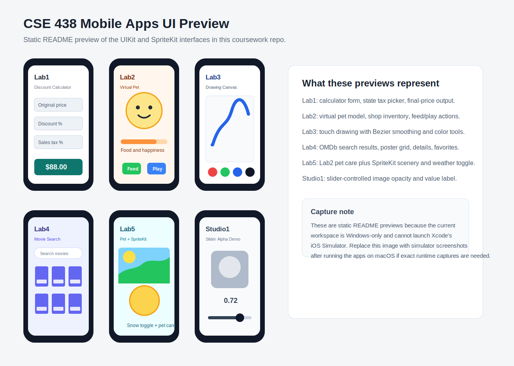

# CSE 438 Mobile Application Development Coursework

This repository contains iOS coursework for CSE 438, a mobile application development class. It is organized as a collection of small Xcode projects and one Swift playground studio. The projects are practice assignments rather than one single production app.

The main work in this repo is learning and demonstrating UIKit, SpriteKit, app state, user input, collection views, networking, persistence, and XCTest-based unit testing.

## Repository Contents

| Path | Type | What it does |
| --- | --- | --- |
| `Studio1/` | iOS app | Intro UIKit app with a slider that updates a label and changes an image view alpha. |
| `Studio2/SwiftStudio.playground/` | Swift playground | Swift language exercises covering variables, control flow, functions, collections, enums, optionals, objects, protocols, closures, extensions, UIKit, and error handling. The playground includes page-level exercise tests in `Sources/`. |
| `Lab1/` | iOS app | Discount and sales-tax calculator. The interface accepts an original price, discount percentage, and tax percentage, then displays a formatted final price. It also includes a picker of state tax rates. |
| `Lab2/` | iOS app | Virtual pet care game. The model tracks pets, food, happiness, evolution, player coins, inventory, shop items, and item effects. |
| `Lab3/` | iOS app | Drawing/sketching app. Users draw paths, and the app smooths touch points into quadratic Bezier paths with configurable stroke color, width, and alpha. |
| `Lab4/` | iOS app | Movie search and favorites app. It searches the OMDb API, displays posters in a collection view, caches poster images, shows detail pages, and persists favorite IMDb IDs in `UserDefaults`. |
| `Lab5/` | iOS app | Extension of the Lab2 virtual pet app with SpriteKit scenery, animated scrolling backgrounds, and snow toggling. |

## App Interfaces

The repo already contains UIKit/SpriteKit interfaces in the Xcode projects:

- Lab1 uses text fields, a label, and a picker view for the calculator flow.
- Lab2 and Lab5 use storyboard-based pet/game screens plus shop and inventory views.
- Lab3 uses a custom drawing view and color buttons.
- Lab4 uses a search bar, collection view, navigation, detail screen, and favorites state.
- Studio1 uses a slider, label, and image view.

No separate web interface was added because this is an iOS coursework repository and the existing deliverables are native mobile app interfaces.

## Screenshots

The apps are native iOS projects, and exact simulator screenshots require macOS with Xcode. This Windows workspace cannot launch the iOS Simulator, so the README includes a committed static UI preview of the coursework app screens instead of runtime-captured simulator images.



To replace the preview with exact screenshots, open the relevant lab in Xcode, run it on an iOS Simulator, capture the screen, save the image under `docs/screenshots/`, and update this section with the captured file path.

## Unit Tests

The original Xcode projects had generated XCTest targets, but most test files were still template placeholders. Those placeholders have been replaced with behavior-focused unit tests:

- `Lab1/Lab1Tests/Lab1Tests.swift`
  - Verifies final price calculation.
  - Verifies invalid discount/tax handling.
  - Verifies numeric text formatting.
- `Lab2/Lab2Tests/Lab2Tests.swift`
  - Verifies pet feeding, happiness, play limits, and evolution rules.
  - Verifies shop item effects and negative-price normalization.
  - Verifies player purchasing, item use, inventory mutation, and out-of-range item indexes.
- `Lab3/Lab3Tests/Lab3Tests.swift`
  - Verifies drawing path configuration.
  - Verifies quadratic path creation behavior.
  - Verifies dot path bounds.
- `Lab4/Lab4Tests/Lab4Tests.swift`
  - Verifies movie result model fields.
  - Verifies collection view section grouping by rows of three.
- `Lab5/Lab2Tests/Lab2Tests.swift`
  - Verifies the Lab2 pet model still works in the Lab5 project.
  - Verifies player bounds checks.
  - Verifies SpriteKit snow toggling adds and removes the emitter node.

Shared Xcode schemes were added under each lab project's `xcshareddata/xcschemes/` directory so tests can run from CI without relying on a developer's local Xcode user data.

## Local Test Commands

These projects require macOS with Xcode because they are iOS apps.

Run all lab unit tests:

```bash
bash scripts/test_ios_projects.sh
```

Run one lab:

```bash
bash scripts/test_ios_projects.sh Lab2/Lab2.xcodeproj Lab2
```

The script runs:

```bash
xcodebuild test \
  -project <project> \
  -scheme <scheme> \
  -destination "platform=iOS Simulator,name=iPhone 16" \
  -enableCodeCoverage YES \
  CODE_SIGNING_ALLOWED=NO
```

If your installed simulator has a different name, override the destination:

```bash
DESTINATION="platform=iOS Simulator,name=iPhone 15" bash scripts/test_ios_projects.sh
```

## Code Improvements

Small compatibility and correctness fixes were made while adding tests:

- `Lab2/Lab2/Player.swift` and `Lab5/Lab2/Player.swift` now guard both negative indexes and `itemIndex == bag.count`, preventing array-index crashes when buying or using inventory items.
- `Lab3/Lab3/PathView.swift` uses `CGFloat.pi` instead of the legacy `M_PI` constant.
- `Lab4/Lab4/FirstViewController.swift` uses `UIColor(white:alpha:)` instead of the older color literal initializer.
- Xcode project Swift build settings were updated from Swift 3.0 to Swift 5.0 for current GitHub-hosted macOS runners.

## GitHub Actions Pipeline

The workflow lives at `.github/workflows/ci.yml`.

### Unit Tests

The `Unit Tests` job runs on `macos-15` and uses a matrix for:

- Lab1
- Lab2
- Lab3
- Lab4
- Lab5

Each matrix entry runs the shared `scripts/test_ios_projects.sh` command with code coverage enabled.

### Code Scanning: Quality

The `Code Scanning / Quality / SwiftLint` job installs SwiftLint with Homebrew and runs:

```bash
swiftlint lint --config .swiftlint.yml
```

The configuration is intentionally lenient because this is legacy coursework code. It focuses the pipeline on useful quality feedback without turning the initial modernization into a large style rewrite.

### Code Scanning: Security

The `Code Scanning / Security / CodeQL` job uses GitHub's official CodeQL action for Swift:

- Initializes CodeQL with Swift.
- Runs the iOS test/build script so CodeQL can observe the build.
- Uploads CodeQL analysis results to GitHub code scanning.
- Uses both `security-extended` and `security-and-quality` query suites.

GitHub documents code scanning as available for public repositories, while private repositories may require GitHub Advanced Security depending on the account and repository settings.

The `Code Scanning / Security / Dependency Review` job runs on pull requests with `actions/dependency-review-action@v4`. This checks dependency changes introduced by a PR. This repo does not currently use CocoaPods, Swift Package Manager dependencies, or npm packages, so the most relevant dependency surface today is GitHub Actions.

### Dependency Automation

Dependabot is configured in `.github/dependabot.yml` for the `github-actions` ecosystem. It will open weekly pull requests for newer versions of workflow actions.

## Notes And Limitations

- Local test execution could not be verified on Windows because `xcodebuild` and iOS simulators require macOS/Xcode.
- The OMDb API calls in Lab4 use the original assignment-era URL style and no API key. The unit tests avoid live network calls.
- The image assets referenced by the iOS projects are intentionally kept as coursework assets. Generated build products, Xcode user data, and derived data remain ignored.
